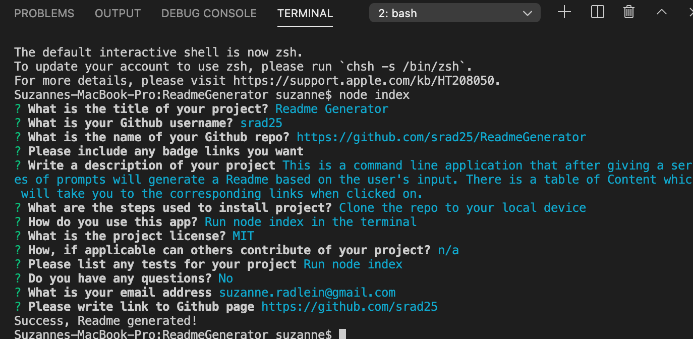
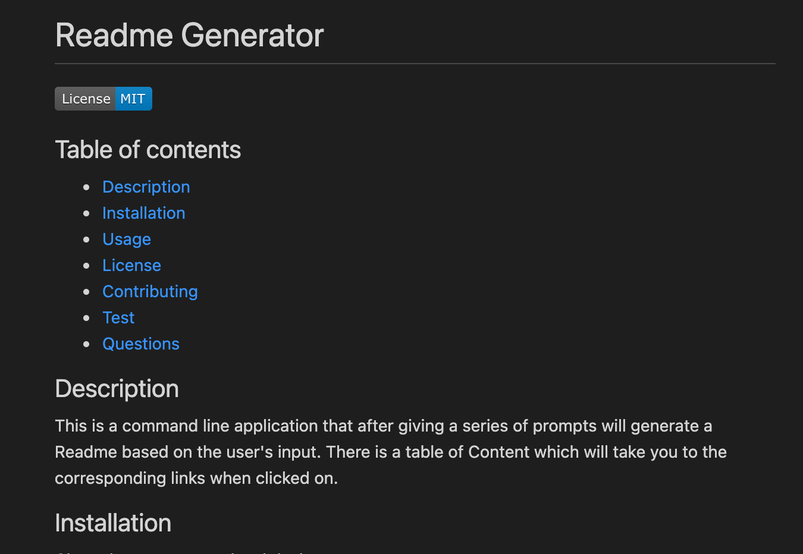

# ReadMe Generator

## Description
This is a command line application that after giving a series of prompts will generate a Readme based on the user's input. There is a table of Content which will take you to the corresponding links when clicked on.

## Technologies Used
* Node js
* Inquirer

## Project Screenshots and Demo

Application being ran in command line. User is prompted to answer a series of questions. At the end of series a new Readme will be generated.

A preview of the generated Readme.

#### Link to Demo

[Video](https://drive.google.com/file/d/1vM6GA6BfPlOkuTY_3XzmMmK0teUJW7v6/view?usp=sharing)

## Contact
* https://github.com/srad25
* https://github.com/srad25/ReadmeGenerator